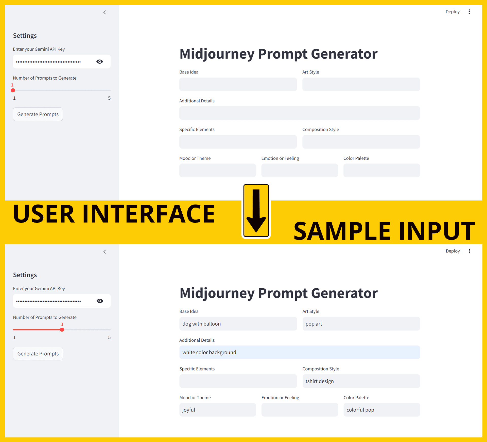
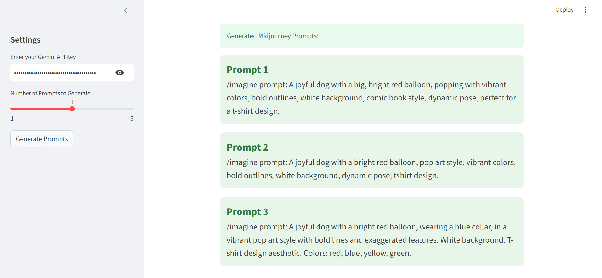
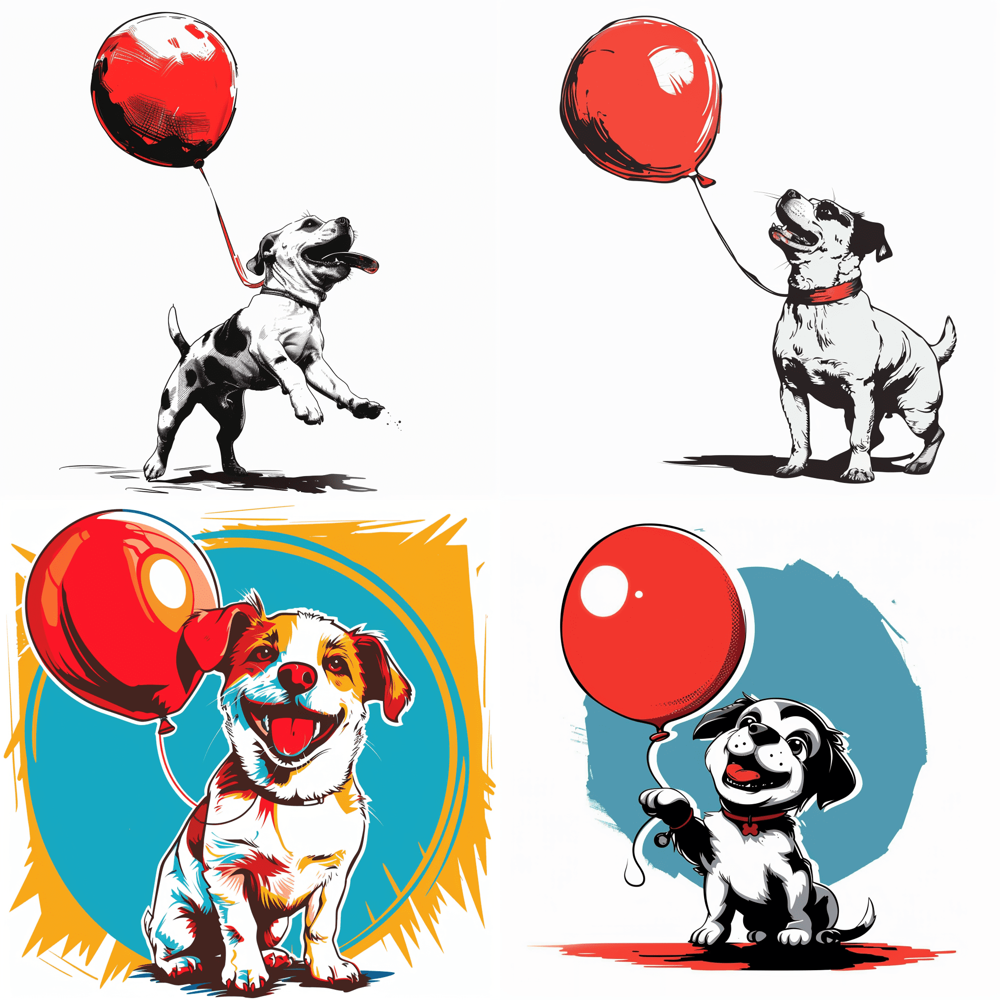
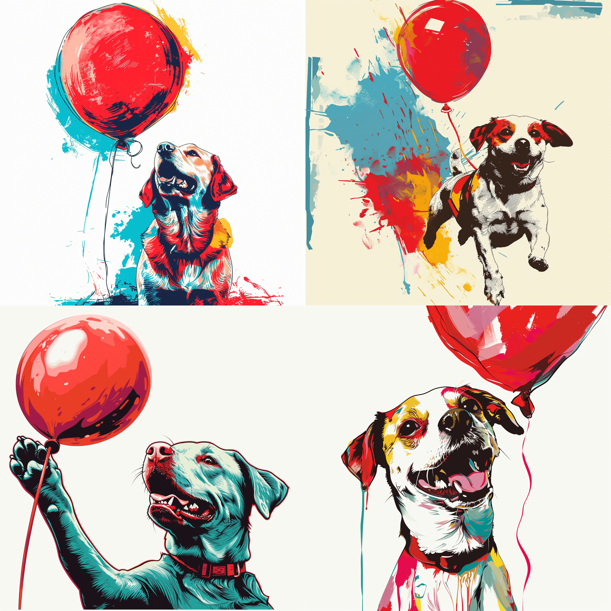
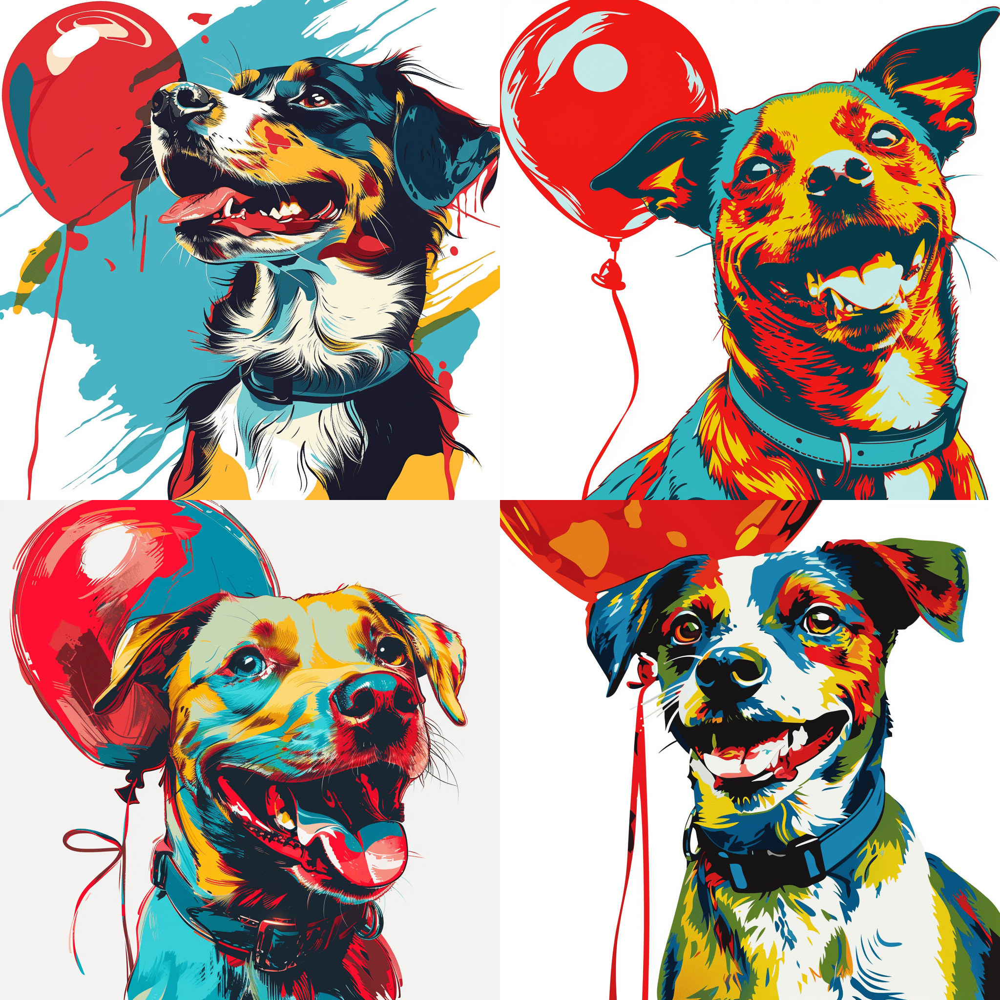

# Midjourney Prompt Generator

The **Midjourney Prompt Generator** is a Python-based application that allows users to generate high-quality prompts for Midjourney, an AI tool for creating artistic images. This tool integrates with the Gemini API to generate prompts based on user inputs.


## Project Overview

The Midjourney Prompt Generator is designed to help users create prompts for the Midjourney AI, which can be used to generate artistic images. The application provides a user-friendly interface for entering various prompt parameters and generates refined prompts ready for use with Midjourney.

## Features

- **User-Friendly Interface**: A Streamlit web app that allows easy input of prompt parameters.
- **Customizable Prompts**: Users can specify various elements such as base idea, art style, mood, and more.
- **API Integration**: Utilizes the Gemini API to generate prompts.
- **Prompt Management**: Generates and displays multiple prompts based on user specifications.

## Getting Started

### Prerequisites

- Python 3.7 or later
- Streamlit
- `python-dotenv` for environment variable management
- `google-generativeai` for Gemini API integration

### Installation

1. **Clone the Repository**:
    ```bash
    git clone https://github.com/Nafi7393/Midjourney-Prompt-Builder.git
    cd Midjourney-Prompt-Builder
    ```

2. **Create a Virtual Environment** (optional but recommended):
    ```bash
    python -m venv venv
    source venv/bin/activate  # On Windows use `venv\Scripts\activate`
    ```

3. **Install Dependencies**:
    ```bash
    pip install -r requirements.txt
    ```

4. **Create a `.env` File**:
    Create a `.env` file in the root directory of the project and add your Gemini API key:
    ```plaintext
    GEMINI_API_KEY=your_gemini_api_key
    ```

### Setup

1. **Streamlit**:
   Make sure you have Streamlit installed to run the web interface. If not, install it using:
   ```bash
   pip install streamlit
   ```

2. **Run the Application**:
    ```bash
    streamlit run app.py
    ```

## Usage

1. **Open the Application**:
   Navigate to `http://localhost:8501` in your web browser to access the Streamlit app.
2. **Input Parameters**:
   - **Base Idea**: Enter the core concept for the artwork.
   - **Art Style**: Specify the desired art style (e.g., pop art, surrealism).
   - **Mood or Theme**: Describe the mood or theme of the artwork.
   - **Specific Elements**: Add any specific elements to be included in the artwork.
   - **Emotion or Feeling**: Specify the emotion or feeling to evoke.
   - **Color Palette**: Choose the color palette for the artwork.
   - **Additional Details**: Provide any additional details to enhance the prompt.
   - **Composition Style**: Define the composition style of the artwork.
   - 
#### Interface


3. **Generate Prompts**:
   Click the "Generate Prompts" button to create prompts based on your inputs.

4. **View Results**:
   The generated prompts will be displayed in the app, ready for use with Midjourney.

#### Generated Prompts


## Demo

Below is a demo showcasing the generated prompts and corresponding images. The images are for visualization purposes and demonstrate the potential output of using the generated prompts with Midjourney.

| **Prompts**                   | **Generated Images**          |
|-------------------------------|-------------------------------|
| /imagine prompt:A joyful dog with a big, bright red balloon, popping with vibrant colors, bold outlines, white background, comic book style, dynamic pose, perfect for a t-shirt design              |  |
| /imagine prompt:A joyful dog with a bright red balloon, pop art style, vibrant colors, bold outlines, white background, dynamic pose, tshirt design |  |
| /imagine prompt:A joyful dog with a bright red balloon, wearing a blue collar, in a vibrant pop art style with bold lines and exaggerated features. White background. T-shirt design aesthetic. Colors: red, blue, yellow, green |  |

**Note**: The project only generates prompts. You need to use Midjourney to create the actual images based on these prompts.

## Gemini API

The Gemini API is used to generate prompts for Midjourney. To use this tool, you need an API key from Gemini. You can obtain your API key by following the instructions in the [Gemini API Documentation](https://ai.google.dev/gemini-api/docs/api-key).

**Steps to Get an API Key**:
1. Visit the [Gemini API Key page](https://ai.google.dev/gemini-api/docs/api-key).
2. Sign in with your Google account.
3. Follow the instructions to generate and obtain your API key.

## Contributing

Contributions are welcome! If you would like to contribute to this project, please follow these steps:

1. Fork the repository.
2. Create a new branch (`git checkout -b feature/your-feature`).
3. Make your changes and commit them (`git commit -am 'Add new feature'`).
4. Push to the branch (`git push origin feature/your-feature`).
5. Create a new Pull Request.
